# Tracing

Nerdbox supports distributed tracing across the full container startup path,
including spans that originate inside the VM. Traces are exported via
OTLP/HTTP (JSON) to any compatible collector (e.g., Jaeger).

## Tracing with Jaeger

This requires docker to run the Jaeger service.

```bash
make test-tracing

# Open the Jaeger UI in the browser
make jaeger-open

# Make a Mermaid gantt diagram
make jaeger-gantt

# Stop Jaeger
make jaeger-stop
```

An example gantt looks like this:

```mermaid
gantt
    dateFormat x
    axisFormat %s.%L s
    title Trace for nerdbox-vm

    section VM.NewInstance+Start
    nerdbox/VM.NewInstance+Start :VM_NewInstance+Start_6f2822, 0, 76
    . nerdbox/libkrun.VMStart :libkrun_VMStart_ae5193, 5, 76
    . nerdbox/TTRPC.Task.Create :TTRPC_Task_Create_902d0f, 77, 93
    . . nerdbox//containerd.task.v3.Task/Create :_containerd_task_v3_Task_Create_16dfce, 77, 93
    . . . /containerd.task.v3.Task/Create :_containerd_task_v3_Task_Create_71056a, 77, 80
    . . . . task.Create :task_Create_451e10, 77, 80
    . . . . . runc.NewContainer :runc_NewContainer_52991d, 77, 80
    . . . . . . crun.create :crun_create_d919ef, 77, 80
    . nerdbox/TTRPC.Task.Start :TTRPC_Task_Start_9e039e, 93, 95
    . . nerdbox//containerd.task.v3.Task/Start :_containerd_task_v3_Task_Start_b248bf, 93, 95
    . . . /containerd.task.v3.Task/Start :_containerd_task_v3_Task_Start_55073e, 93, 95
    . . . . task.Start :task_Start_f96cf6, 93, 95
    . . . . . container.Start :container_Start_f896e9, 93, 95
    . . . . . . crun.start :crun_start_9680f1, 93, 95
```

